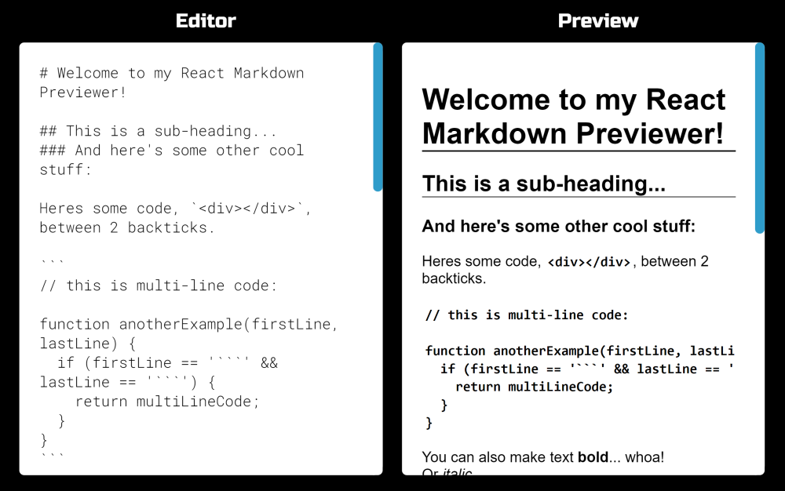
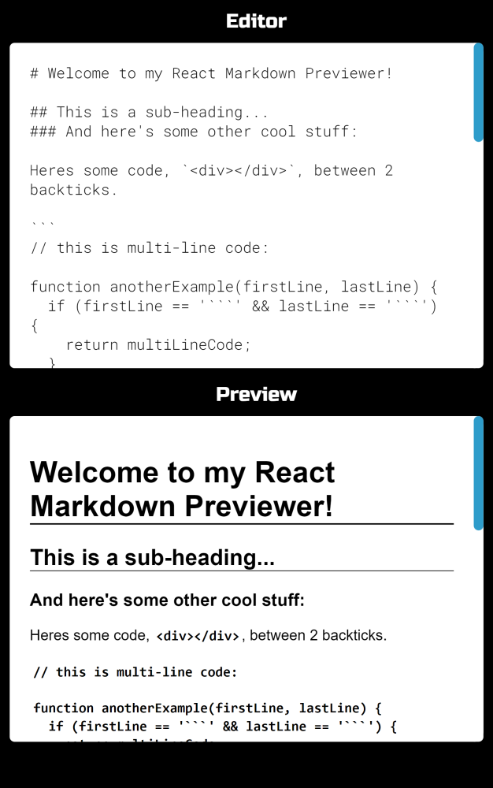

# [freeCodeCamp Front End Development Libraries certification](https://www.freecodecamp.org/learn/front-end-development-libraries/)

## [Build a Markdown Previewer project](https://www.freecodecamp.org/learn/front-end-development-libraries/front-end-development-libraries-projects/build-a-markdown-previewer)

Working example: https://raff1010x.github.io/13.Front-End-Development-Libraries-Projects--Build-a-Markdown-Previewer/

My git repo: https://github.com/Raff1010X/01.Roadmap

